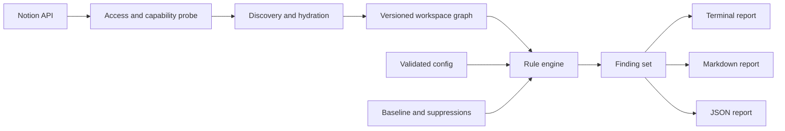

# INPUT: workspace-lint PRD

> **Status: input artifact, not canonical.**
>
> Verbatim local copy of the Notion PRD at
> <https://app.notion.com/p/2d41c2631b5945f196c5688cde44cdf9>, fetched 2026-08-16T20:53Z.
> Artifact date on the page: 2026-08-16. Author line: "2026-08-16 · Hans".
>
> This file exists so agents can read the PRD without a Notion API call. It does not
> govern. Where it disagrees with `CONTEXT.md` or `docs/adr/`, those win — see the
> canonicality rule in `CONTEXT.md`. Do not edit this file to reflect product changes;
> it is a record of what the input said on its artifact date. If the Notion page changes,
> re-fetch and replace this file wholesale, and note the new fetch date above.
>
> Known divergences from the repo as of the fetch date:
> - The PRD says "Public release: Not approved" and "Rollback: no repository has changed."
>   Both are obsolete. The public repository `MrBinnacle/workspace_lint` exists.
> - The PRD lists the package name as **UNMEASURED**. It has since been measured:
>   `workspace-lint` on npm is a security holding package at `0.0.1-security`.
> - Notion mention-links to other pages are preserved as bare URLs; their titles were
>   not resolved at fetch time.

---

**Bottom line:** `workspace-lint` should enter Pocock scope review as a pre-build candidate. It must test explicit rules. It must not infer workspace quality from prose.

| Field | Current state |
| --- | --- |
| Artifact date | 2026-08-16 |
| Product state | Prototype PRD; ready for scope review |
| Build authority | Not approved |
| Public release | Not approved |
| Primary method route | [1e4720e7](https://app.notion.com/p/1e4720e7acfb4744a98e3d0f341d5f5a) → [8152f816](https://app.notion.com/p/8152f816e66e4c6a9171c6cba45dee71) → tickets |
| Conditional on-ramp | Use wayfinder only if scope fog exceeds one session. |

## Diagnosis

The source is a strong concept memo. It is not yet a product contract. It mixes evidence, architecture, estimates, rules, and launch claims.

Two defects require correction before scope review:

- The "40 empty Data Source URL fields" claim is obsolete. The current Directory view contains many populated Data Source URL values.
- Several proposed rules require declared policy. They cannot operate as zero-config deterministic checks.

This PRD separates evidence, scope, rule semantics, system design, acceptance tests, and open decisions.

## Product decision

**Product:** A local, read-only CLI that tests a Notion workspace against explicit structural rules.

**Working tagline:** *CI for Notion workspaces.*

**Core promise:** Run one command. Receive a reproducible report with defects, evidence, direct links, and repair guidance.

**Product finding:** Entropy describes a symptom. A linter provides a testable product contract.

## Evidence ledger

| Claim | Status | PRD decision | Evidence |
| --- | --- | --- | --- |
| The old Directory had about 40 active rows with empty Data Source URLs. | **CUT** | Do not use this as the proof target. The current view disproves the universal claim. | [2efbc922](https://app.notion.com/p/2efbc922813842529e448afe2e3666a4) |
| Current registry gaps can support dogfood tests. | **CONFIRMED** | Use current, scoped defects. Active native rows such as VA Claims Tracker and VA Symptom Log lack a Database URL. | [2efbc922](https://app.notion.com/p/2efbc922813842529e448afe2e3666a4) |
| Current controls often record a defect after discovery. | **CONFIRMED** | The product should detect a declared violation before manual discovery. | [c8ffc02b](https://app.notion.com/p/c8ffc02b54804fb3bd5d5c98f2f18ea8) · [18c5aee1](https://app.notion.com/p/18c5aee1b0354a5cae6635cc0a91f5d2) |
| The API can enumerate the full workspace. | **CUT** | The product can enumerate only pages and data sources shared with its connection. | [Notion Search API](https://developers.notion.com/reference/post-search) |
| The API supports deterministic schema, row, property, and block inspection. | **CONFIRMED** | Proceed to a proof. The crawler must handle pagination, nested blocks, and endpoint limits. | [Query a data source](https://developers.notion.com/reference/query-a-data-source) · [Page content](https://developers.notion.com/guides/data-apis/working-with-page-content) |
| A 404 proves that an internal target is broken. | **CUT** | A 404 means missing or inaccessible. Report this state as indeterminate. | [Retrieve a page](https://developers.notion.com/reference/retrieve-a-page) |
| Zero-config checks can detect owners, uniqueness, peer schemas, and canonical status. | **CUT** | These checks require explicit selectors and policy declarations. | Product logic |
| The package and repository name are available. | **UNMEASURED** | Treat `workspace-lint` as a working name. Check npm, GitHub, and trademarks before repository creation. | Name search did not settle availability. |

## Prior art gate

**Established pattern:** ESLint's pluggable static-analysis rule model. The discipline is compiler and developer-tool design. [\[1\]](https://eslint.org/docs/latest/extend/custom-rules)

| Pattern feature | Current proposal | Action |
| --- | --- | --- |
| Normalized input model | Workspace graph | **Adopt.** Separate API retrieval from rule logic. |
| Independent rules with metadata | Rule IDs and severities | **Adopt.** Add option schemas, messages, docs, and fixture tests. |
| Stable source location | Notion page or row link | **Adapt.** Use resource ID, property or block path, and direct URL. |
| Automatic fixes | Not proposed | **Reject for v0.1.** Read-only access is a product boundary. |
| Project-specific rules | YAML assertions | **Adopt.** Validate configuration before any scan. |
| Permission coverage | Implicit | **Add.** Notion access limits require a first-class coverage manifest. |
| Existing-debt baseline | Proposed | **Adopt.** Keep baseline and suppression as separate concepts. |

The proposal adds one useful feature to the linter pattern. It makes scan coverage part of the result. A green report from a partial workspace is not a pass.

## User and job

### Primary user

A technical Notion owner or administrator with at least ten databases, recurring workflows, and explicit operating rules.

### Secondary user

A consultant or operations lead who must prove that a client workspace still matches its design contract.

### Excluded v0.1 user

A person who expects the tool to decide what the workspace should mean. The product checks declared rules. It does not supply governance judgment.

### Job to be done

> When my workspace changes, show me which declared structural rules no longer hold. Give me enough evidence to repair the defect without a manual census.

### User outcomes

- Detect a new violation before it becomes a manual incident.
- Distinguish a confirmed defect from an access gap.
- Review one stable report instead of reconstructing workspace state.
- Add one useful rule without first modeling the whole workspace.
- Adopt CI later without changing the rule model.

## Goals and non-goals

| Goals for v0.1 | Non-goals for v0.1 |
| --- | --- |
| Read accessible Notion state through official APIs. | Read content that the user did not share. |
| Build a deterministic local graph. | Build a semantic knowledge graph. |
| Test built-in and configured invariants. | Infer intent, quality, ownership, or canon from prose. |
| Report confirmed and indeterminate findings separately. | Hide access gaps inside a passing result. |
| Support a debt baseline with stable fingerprints. | Delete, rewrite, migrate, or repair Notion content. |
| Emit terminal, Markdown, and JSON reports. | Provide a GUI, hosted service, or LLM layer. |
| Protect content and credentials by default. | Send telemetry or load remote rule code. |

## Product principles

1. **A partial scan cannot pass.** The report must state its access boundary and incomplete queries.
2. **A rule must name its evidence.** Each finding points to an object, location, observed value, and expected value.
3. **Unknown is not broken.** Access failure and object absence share a 404 response. The report must preserve that uncertainty.
4. **Policy must be explicit.** The CLI must not infer owner, canon, uniqueness, or peer status from labels alone.
5. **Baseline is not suppression.** Existing debt remains visible. It only stops a new-finding failure.
6. **Content is data, not code.** Page text, links, and YAML values cannot execute commands or load packages.
7. **Read-only means read-only.** The process requests no insert or update capability.

## Experience contract

### Command surface

The package name remains provisional. These commands define the desired interface.

```bash
# Coverage and built-in structural checks
npx workspace-lint scan

# Full policy scan
npx workspace-lint scan --config workspace-lint.yml

# Record current debt without hiding it
npx workspace-lint baseline create --config workspace-lint.yml

# Explain one rule and its configuration
npx workspace-lint explain REQ001
```

### First-run path

1. The user creates a read-only Notion connection.
2. The user shares one test root or database with that connection.
3. The user sets `NOTION_TOKEN` in the shell.
4. `scan` prints the access manifest and built-in checks.
5. `init` or documentation helps the user declare one invariant.
6. The next scan reports the invariant result.

### Report example

```text
workspace-lint 0.1.0
Scope: 18 pages, 3 data sources, 146 blocks
Coverage: COMPLETE for shared scope

ERROR REQ001  VA Claims Tracker / Database URL
  Expected: non-empty URL for an Active Native Database
  Observed: empty
  Open: https://www.notion.so/...
  Fix: add the database route or change the row contract

WARN REF001  Project brief / Related spec
  State: INDETERMINATE
  Evidence: Notion returned 404; the target may be missing or unshared
  Fix: share the target with the connection or inspect the link manually

Summary: 1 new error · 1 indeterminate warning · 0 baseline errors
Exit: 1
```

### Finding contract

| Field | Contract |
| --- | --- |
| `ruleId` | Stable identifier such as `REQ001`. |
| `severity` | `fatal`, `error`, `warning`, or `note`. |
| `certainty` | `confirmed` or `indeterminate`. |
| `resource` | Stable Notion object ID and type. |
| `location` | Property ID, block ID, or graph edge. |
| `evidence` | Observed value, expected value, and API state. |
| `url` | Direct Notion link when available. |
| `remediation` | One plain action. No automatic edit. |
| `fingerprint` | Rule, resource, location, and normalized evidence selector. |
| `baselineState` | `new`, `existing`, `resolved`, or `suppressed`. |

### Exit codes

| Code | Meaning |
| --- | --- |
| `0` | The complete scan found no new violation above the configured threshold. |
| `1` | The scan found one or more new violations above the threshold. |
| `2` | Authentication, configuration, permission, or coverage failure blocked a valid verdict. |
| `3` | The CLI failed because of an internal error. |

## Domain model

| Term | Definition |
| --- | --- |
| Connection | The Notion API identity and its granted read capability. |
| Shared scope | The pages and data sources visible to the connection. |
| Resource | A page, database, data source, block, property, or user. |
| Workspace graph | The normalized resources and edges from one scan. |
| Edge | A parent, child, relation, mention, hyperlink, or configured dependency. |
| Coverage manifest | The resources, limits, errors, and omissions that bound the verdict. |
| Invariant | A structural statement that must remain true. |
| Rule | Executable logic that tests one invariant. |
| Finding | A rule result with evidence and a stable location. |
| Baseline | A set of accepted finding fingerprints that still appear in reports. |
| Suppression | A scoped exception with a reason and expiry. |
| Snapshot | The normalized graph state used for one deterministic run. |
| Canonical marker | An explicit property value or configured pointer. It is not prose inference. |

## Rule catalog for v0.1

| ID | Rule | Mode | Required evidence |
| --- | --- | --- | --- |
| `SYS001` | Scan result is incomplete. | Built-in | Pagination cap, failed endpoint, omitted relation schema, or unfinished traversal. |
| `REF001` | Internal target is archived, in Trash, or unreachable. | Built-in | Target state when visible. A 404 produces an indeterminate warning. |
| `REQ001` | A selected resource lacks a required property value. | Configured | Selector, property ID, expected non-empty state, observed value. |
| `UNQ001` | A declared unique value occurs more than once. | Configured | Selector, property ID, normalized value, matching resources. |
| `SCH001` | Configured peer data sources have incompatible schemas. | Configured | Peer set and normalized property signatures. |
| `REL001` | A relation violates its allowed target contract. | Configured | Source property ID, allowed target IDs, observed target. |
| `DEP001` | An active resource points to an inactive dependency. | Configured | Active selector, dependency edge, inactive state map. |
| `CAN001` | A boundary contains more than one explicit canonical marker. | Configured | Boundary selector and canonical property or pointer. |

`REQ001` covers owner requirements. `CAN001` does not search prose for words such as "canonical" or "SSOT." Orphan detection stays out of v0.1 until the product defines valid roots.

### Configuration and baseline contract

The configuration uses stable Notion IDs as identity. Names are aliases for reports only.

```yaml
version: 1
resources:
  directory:
    dataSourceId: "DATA_SOURCE_ID"

rules:
  - id: REQ001
    name: active-native-databases-must-route
    select:
      dataSource: directory
      where:
        Lifecycle Status: [Active, Needs Review]
        Asset Type: [Native Database, Registry, System Log]
    require:
      - Database URL
      - Data Source URL

  - id: CAN001
    name: one-canonical-artifact-per-project
    select:
      dataSource: projectArtifacts
    boundary: Project
    canonicalWhen:
      Authority: Canonical

suppressions:
  - fingerprint: "sha256:..."
    reason: "External database has no stable Notion route."
    expires: 2026-10-01
```

Configuration rules:

- Reject unknown keys and invalid option types.
- Reject duplicate rule names.
- Resolve names to IDs during `init`. Store IDs in the final file.
- Require a reason and expiry for each suppression.
- Do not allow expressions, scripts, imports, or remote URLs.
- Store baseline fingerprints only. Do not store page text or credentials.
- Keep baseline findings visible as existing debt.

## Functional requirements

| ID | Requirement | Acceptance test |
| --- | --- | --- |
| `FR-01` | Authenticate with read-content capability only. | The proof works without insert or update capability. |
| `FR-02` | Enumerate all pages and data sources in shared scope. | The fixture manifest and crawler count match. |
| `FR-03` | Hydrate schemas, rows, properties, and nested blocks as rules require. | The fixture includes nested blocks and properties above one response page. |
| `FR-04` | Produce a complete coverage manifest. | Any failed or capped traversal returns exit code `2`. |
| `FR-05` | Normalize API objects into one versioned graph schema. | Rules use no Notion SDK response type directly. |
| `FR-06` | Validate configuration before retrieval work. | An invalid file fails before the first content request. |
| `FR-07` | Run all enabled rules deterministically. | The same snapshot and config produce identical findings and fingerprints. |
| `FR-08` | Separate confirmed and indeterminate results. | A seeded 404 never appears as a confirmed broken link. |
| `FR-09` | Create and compare a debt baseline. | A known baseline error stays visible and does not fail "new only" mode. |
| `FR-10` | Apply scoped suppressions with expiry. | An expired suppression fails validation or returns a warning. |
| `FR-11` | Emit terminal, Markdown, and versioned JSON output. | Golden-file tests cover all three formats. |
| `FR-12` | Return stable exit codes. | Tests cover clean, violated, incomplete, and internal-error runs. |
| `FR-13` | Provide a direct Notion URL for each visible resource. | Every confirmed finding in the fixture opens the affected resource. |
| `FR-14` | Redact tokens and sensitive text from logs. | Secret-pattern and fixture-text tests find no leak. |

## Non-functional requirements

- **Determinism:** The same snapshot, rules, and tool version produce byte-stable JSON after timestamp removal.
- **Safety:** The CLI uses no Notion write endpoint.
- **Privacy:** Local mode sends data only to the Notion API. It sends no telemetry.
- **Performance:** A scoped Directory scan completes within two minutes on the reference machine.
- **Full-scope target:** A warm scan completes within three minutes. A cold scan completes within fifteen minutes.
- **Resilience:** The client respects `Retry-After` and retries safe requests with bounded backoff.
- **Portability:** Support active Node.js LTS releases on macOS, Windows, and Linux.
- **Testability:** A synthetic fixture represents every rule, API limit, and exit path.
- **Compatibility:** The snapshot and JSON report carry explicit schema versions.

## System design



### Proposed modules

| Module | Responsibility |
| --- | --- |
| `auth` | Token discovery, capability probe, and safe error messages. |
| `client` | Rate limits, retries, pagination, and API version pin. |
| `crawl` | Discovery, selective hydration, and coverage accounting. |
| `graph` | Normalized resources, edges, indexes, and snapshot format. |
| `config` | YAML parsing, JSON Schema validation, and ID resolution. |
| `rules` | Pure rule functions and rule metadata. |
| `baseline` | Finding fingerprints, debt state, and suppression expiry. |
| `reporters` | Terminal, Markdown, and JSON output. |
| `fixtures` | Synthetic API responses and end-to-end workspace cases. |

### Retrieval strategy

1. Search without a query to enumerate shared pages and data sources.
2. Follow every cursor and inspect each `request_status`.
3. Retrieve each data source schema.
4. Query rows only for enabled rules.
5. Retrieve complete relation or mention properties when the first response truncates them.
6. Traverse block children only for rules that inspect references.
7. Keep page bodies in memory only. Persist graph metadata and content hashes.
8. Record each skipped, capped, failed, or inaccessible resource in the coverage manifest.

### Confirmed Notion API constraints

> These were the PRD's claims on 2026-08-16. Re-verification is in progress; do not
> treat them as current without checking the citation.

- Search returns only pages and data sources shared with the connection. It excludes duplicate linked databases. [\[2\]](https://developers.notion.com/reference/post-search)
- Data source queries use cursors. One query stops at 10,000 results and marks the result incomplete. [\[3\]](https://developers.notion.com/reference/query-a-data-source)
- Large data sources require time-window partitions or an explicit incomplete result.
- The API rate is about three requests each second per connection. A workspace-wide limit also applies. [\[4\]](https://developers.notion.com/reference/request-limits)
- Page properties return at most 25 references in one page response. The crawler must use the property-item endpoint for complete values. [\[5\]](https://developers.notion.com/reference/retrieve-a-page)
- Block lists return at most 100 results each page. Nested blocks require recursive requests. [\[6\]](https://developers.notion.com/guides/data-apis/working-with-page-content)
- A 404 means that an object is absent or inaccessible. The API does not identify which case applies.
- Relation schema can disappear when the related database is not shared. Coverage must record this omission. [\[7\]](https://developers.notion.com/reference/retrieve-a-data-source)
- Linked data sources cannot serve as the schema source. The original source database must be shared.

## Security, privacy, and legal boundary

### Local mode for v0.1

- Read the token from `NOTION_TOKEN` or a named environment variable.
- Do not store the token in YAML, reports, baselines, or cache files.
- Make no network request except to the official Notion API.
- Keep page body text in memory only.
- Persist IDs, timestamps, schema metadata, graph edges, fingerprints, and hashes only when required.
- Redact token-like strings, emails, and long text from diagnostic logs.
- Disable dynamic plugins and remote configuration.
- Parse page text as data. Never execute or evaluate it.

### CI is a separate privacy mode

A GitHub Action sends report data to GitHub logs or artifacts. It also places the Notion token in a GitHub secret. This mode contradicts a strict local-only claim.

The core release can ship without CI. An opt-in CI release requires:

- a separate threat review;
- title redaction by default;
- no page body output;
- explicit log and artifact retention guidance;
- least-privilege repository permissions;
- a self-hosted-runner option;
- proof that SARIF can represent Notion locations usefully.

### Release screen

- Confirm Notion API and developer-term compliance.
- Confirm package and project licenses.
- Generate a dependency license report.
- Add a descriptive-use trademark notice and non-affiliation statement.
- Publish a data-flow diagram and privacy statement.
- Do not describe a security review as complete until an independent review occurs.

## Success measures

### Primary measure

**Accepted finding rate:** confirmed findings that a user accepts as real and useful, divided by reviewed confirmed findings.

### Release targets

- At least 85% accepted finding rate after configuration.
- All seeded fixture defects detected.
- Zero seeded false claims about inaccessible targets.
- Zero green reports from an incomplete scan.
- One useful declared rule within fifteen minutes of setup.
- Stable finding fingerprints across two unchanged runs.
- No token or page-body text in persisted artifacts.

### Product validation

Test with three technically capable Notion owners. Each person must identify at least one new defect that changes a repair decision.

Downloads, rule count, and GitHub stars do not validate the product.

## 72-hour proof gate

The proof answers one question: **Can the official API support a complete, deterministic, useful scan of a declared scope?**

### Fixture

Create a private test workspace or shared root with:

- three data sources;
- at least twelve pages;
- one nested block tree;
- one archived target;
- one unshared target;
- one missing required value;
- one duplicate declared unique value;
- one peer-schema mismatch;
- one active-to-inactive dependency;
- two explicit canonical markers in one boundary.

### Required proof

- [ ] Enumerate the complete shared fixture and match a hand-written manifest.
- [ ] Retrieve full schemas, rows, long relation values, and nested blocks.
- [ ] Detect every seeded confirmed defect.
- [ ] Label the unshared target as indeterminate, not broken.
- [ ] Run `REQ001` against the current Directory and detect a current route gap.
- [ ] Emit one readable Markdown report and one stable JSON report.
- [ ] Return exit code `2` after a seeded pagination or retrieval failure.
- [ ] Complete the scoped Directory scan within two minutes.
- [ ] Persist no token or page-body text.

### Stop condition

Stop the project if the proof cannot produce a complete coverage manifest and stable findings without write access or an LLM.

## MVP plan

The three-weekend estimate is a hypothesis. The proof must pass first.

| Phase | Deliverable | Exit gate |
| --- | --- | --- |
| 72-hour proof | Fixture crawler, graph slice, two rules, Markdown and JSON report. | All proof checks pass. |
| Weekend 1 | Production client, coverage manifest, normalized graph, safe cache. | Complete fixture and Directory scans pass twice. |
| Weekend 2 | Validated config, eight-rule catalog, baseline, suppressions. | Golden tests and deterministic reruns pass. |
| Weekend 3 | CLI polish, docs, package, privacy notes, and three-user test kit. | Release targets pass or the scope reduces. |
| Post-core option | GitHub Action and SARIF experiment. | Privacy and location-model gates pass. |

No GUI enters the plan before user evidence shows that the CLI blocks adoption.

## Kill criteria

Stop or narrow the product when any condition holds:

- The API cannot prove scan completeness for a declared scope.
- Stable findings require prose interpretation or an LLM.
- A configured scan stays below 85% accepted finding rate.
- Three design partners produce fewer than three total decision-relevant findings.
- A warm scan exceeds three minutes on the reference scope after selective hydration.
- The baseline cannot retain stable identity after normal page moves or renames.
- The privacy contract requires page-body persistence or unapproved third-party transmission.
- The useful product reduces to a one-off script for this workspace.

## Pocock scope-review handoff

The method follows [3b21351d](https://app.notion.com/p/3b21351d6af481eb89b8db4a75911996). Use [1e4720e7](https://app.notion.com/p/1e4720e7acfb4744a98e3d0f341d5f5a) first. Use [5910240d](https://app.notion.com/p/5910240d1c1c475b8d4b29c7816a7b1a) during the interview. Use [8152f816](https://app.notion.com/p/8152f816e66e4c6a9171c6cba45dee71) only after the decision tree closes.

### Settled decisions

- The product is a linter, not an entropy engine.
- The core runs locally and uses read-only API access.
- The rule engine is deterministic.
- Policy checks require explicit configuration.
- A partial scan cannot pass.
- The product reports uncertainty instead of converting it to an error.
- v0.1 does not modify Notion.
- CI is an optional mode with a separate privacy contract.

### Grill queue

- [ ] Confirm the primary user: technical owner, consultant, or internal operations lead. **Default:** technical owner.
- [ ] Confirm the first release scope: metadata-only or selective block crawl. **Default:** selective crawl by enabled rule.
- [ ] Choose the minimum useful rules after the proof. **Default:** `SYS001`, `REF001`, `REQ001`, and `UNQ001`.
- [ ] Confirm resource identity in config. **Default:** stable IDs with readable aliases.
- [ ] Confirm baseline policy. **Default:** report old debt; fail only new errors.
- [ ] Confirm CI timing. **Default:** after the local core release.
- [ ] Set cold and warm performance budgets on one named reference workspace.
- [ ] Check the package, repository, and trademark name before repository creation.
- [ ] Decide whether page titles may appear in CI output. **Default:** redact them.
- [ ] Ratify the proof result before any three-weekend build starts.

### Edge cases for grilling and specification

- A target returns 404 because it is unshared, deleted, or moved.
- A related database is not shared, so the relation property vanishes from schema output.
- Two data sources have the same visible name.
- A page moves but keeps its object ID.
- A relation or mention contains more than 25 references.
- A block list exceeds 100 children or contains unsupported block types.
- A data source query reaches the 10,000-result cap.
- A scan receives 429, 529, or a retriable server error after partial progress.
- A baseline fingerprint changes after a property rename.
- A configured property no longer exists.
- A canonical marker appears on an archived artifact.
- A dashboard has no owned data source and should not fail a native-database rule.
- A linked data source points to an original source outside shared scope.
- A suppression expires during CI.
- A malicious page contains shell commands, YAML fragments, or prompt instructions.

### Required output from scope review

The Pocock session must produce:

- one final primary user;
- one closed v0.1 rule set;
- one versioned domain glossary;
- one accepted graph and finding schema;
- one fixture contract;
- one privacy boundary;
- one proof plan with measured budgets;
- explicit ADRs for disputed trade-offs;
- a spec that can divide into independent tickets.

## Verdict

**HOLDS:** `workspace-lint` survives as a pre-scope product candidate after the evidence and scope corrections above.

**Evidence limit:** No executable proof or external user test exists.

**Kill criterion:** Stop if complete deterministic findings require write access, page-body persistence, or an LLM.

**Supersedes:** The witness kit recommendation and the workspace entropy engine framing.

**Rollback:** Archive or trash this project row. No repository, public surface, or external system has changed.

---

**2026-08-16 · Hans · Action:** Rebuilt the workspace-lint concept into a pre-scope PRD. Corrected the obsolete Directory claim, separated deterministic checks from configured policy, added API limits, proof gates, privacy modes, and a Pocock grill queue. **Related:** [2efbc922](https://app.notion.com/p/2efbc922813842529e448afe2e3666a4), [c8ffc02b](https://app.notion.com/p/c8ffc02b54804fb3bd5d5c98f2f18ea8), [18c5aee1](https://app.notion.com/p/18c5aee1b0354a5cae6635cc0a91f5d2), [3b21351d](https://app.notion.com/p/3b21351d6af481eb89b8db4a75911996). **Rollback:** Move this project row to Archive or Trash. No code or public artifact changed.
